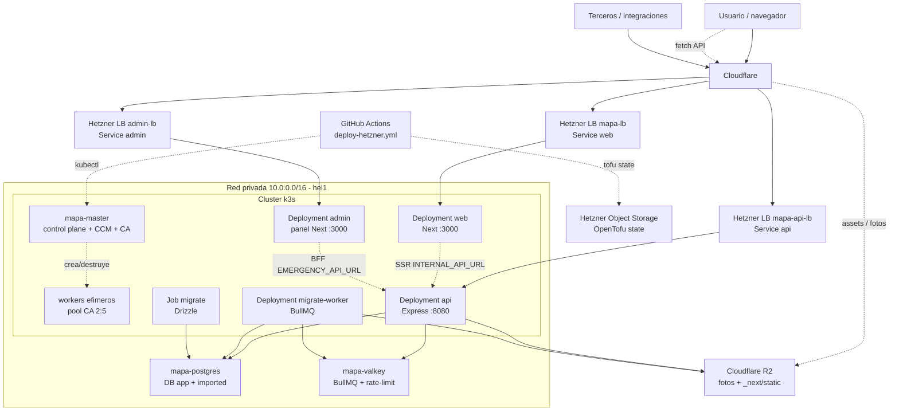

# Arquitectura del despliegue (Hetzner + k3s + OpenTofu)

Cómo está desplegada **hoy** la plataforma: infraestructura en Hetzner Cloud
provisionada con **OpenTofu**, clúster **k3s**, dos servicios de aplicación
separados (`frontend` y `backend`), workers BullMQ, y **Cloudflare** delante
(DNS/CDN/TLS + R2).

> Fuente de verdad de la infra: `infra/tofu/` (servidores, red, firewall) e
> `infra/k8s/` (manifiestos del clúster). El pipeline que aplica el despliegue
> de app es `.github/workflows/deploy-hetzner.yml`.

## Resumen

- **Provisión:** OpenTofu con provider `hcloud`, estado remoto en Hetzner Object
  Storage (bucket `terremoto-vzla-bucket`, hel1), no en R2.
- **Cómputo:** k3s con 1 master fijo y workers efímeros manejados por
  cluster-autoscaler. `k3s_worker_count` tiene default `0`; el pool del CA es
  `--nodes=2:5`.
- **Apps:** tres imágenes y tres Deployments:
  - `web`: imagen `*-frontend:<sha>`, Next standalone en `:3000`.
  - `api`: imagen `*-backend:<sha>`, Express en `:8080`.
  - `admin`: imagen `*-admin:<sha>`, panel Next standalone en `:3000` (3er tier,
    RFC 0005; BFF que reenvía al backend por la red interna).
- **Workers:** `migrate-worker` y el Job `migrate` reutilizan la imagen backend
  con comandos distintos.
- **Estado:** Postgres y Valkey viven en VPS dedicados dentro de la red privada.
- **Ingreso:** tres Services `LoadBalancer`: `web` -> `mapa-lb`, `api` ->
  `mapa-api-lb` y `admin` -> `admin-lb`.
- **Borde:** Cloudflare proxied; R2 sirve fotos y assets estáticos de Next
  cuando `NEXT_PUBLIC_ASSET_PREFIX` está configurado.

## OpenTofu

Archivos en `infra/tofu/`:

| Archivo | Qué crea |
| --- | --- |
| `network.tf` | Red privada `mapa-net` (`10.0.0.0/16`) + subnet `10.0.1.0/24` |
| `k3s-master.tf` | Servidor `mapa-master` (`10.0.1.5`) |
| `k3s-workers.tf` | Workers fijos opcionales; default `0` porque manda el autoscaler |
| `postgres.tf` | VPS `mapa-postgres` (`10.0.1.10`) + volumen |
| `valkey.tf` | VPS `mapa-valkey` (`10.0.1.11`) |
| `firewall.tf` | Firewall público para SSH y API k3s de CI |
| `backend.tf` | Estado remoto S3-compatible en Hetzner Object Storage |
| `cloud-init/*.tftpl` | Bootstrap de k3s, Postgres y Valkey |

Puntos clave:

- Las IPs privadas fijas mantienen estables `DATABASE_URL`, `VALKEY_URL` y la
  dirección del master.
- Postgres y Valkey son PETs protegidas con `prevent_destroy`; no se recrean
  como parte del deploy normal.
- La app usa la base `app`. La base `imported` queda reservada para importación
  y sync.
- Neon solo queda como origen legado para backfills (`NEON_DATABASE_URL`).

## k3s

El master corre k3s con Hetzner CCM externo:

- `cloud-provider=external` para que el CCM maneje nodos y Load Balancers.
- `--disable traefik servicelb` para usar LB de Hetzner.
- Flannel usa la red privada (`enp7s0`).
- El Cluster Autoscaler de Hetzner crea y destruye workers efímeros cuando los
  pods quedan pendientes o sobran nodos.

## Manifiestos principales

| Manifiesto | Rol |
| --- | --- |
| `service.yaml` | Namespace `mapa` + Services `web`, `api` y `admin` con TLS por target |
| `deployment.yaml` | Deployments `web` (frontend), `api` (backend) y `admin` (panel) |
| `hpa.yaml` | HPA separado por tier (`web`, `api` y `admin`) |
| `cluster-autoscaler.yaml` | Autoscaler de nodos Hetzner |
| `worker-deployment.yaml` | Workers BullMQ con imagen backend |
| `migrate-job.yaml` | Migraciones Drizzle gateadas antes del rollout |
| `migrate-enqueue-job.yaml` | Productor manual para backfills/migración de datos |
| `hub-backfill-job.yaml` | Backfill del hub federado |
| `secret.example.yaml` | Plantilla de runtime secrets |

## Tiers `web`, `api` y `admin`

Los tres tiers están separados a propósito:

- `web` corre el frontend Next en `:3000`. No sirve la API ni accede a Postgres.
  El navegador usa `NEXT_PUBLIC_API_URL`; server components pueden usar
  `INTERNAL_API_URL`.
- `api` corre Express en `:8080`. Sirve toda la superficie `/api`, CORS,
  Turnstile, rate-limit, OpenPanel proxy y acceso Drizzle.
- `admin` corre el panel Next standalone en `:3000` (imagen propia `*-admin`,
  réplicas bajas, HPA 2–6). El navegador habla same-origin con su BFF
  (`app/api/*`), que reenvía al backend por la red interna
  (`EMERGENCY_API_URL=http://api.mapa.svc.cluster.local`) con el JWT leído de una
  cookie httpOnly. Probes a `/api/health` (su BFF, desacoplado de upstreams).
  Ver [RFC 0005](../rfcs/0005-panel-admin-standalone.md).
- Cada tier tiene su propio Service LoadBalancer, HPA, probes y recursos. Un
  pico de API no debe ahogar el render del frontend ni el panel de rescate.
- El rollout usa `maxUnavailable: 0`, `maxSurge: 1`, probes de readiness y
  `preStop` para drenar pods viejos.

## Workers, migraciones y schedulers

- `migrate-worker` reutiliza la imagen backend y ejecuta `npx tsx worker/index.ts`.
- El Job `migrate` reutiliza la imagen backend y ejecuta `npm run migrate`.
- `migrate-env` contiene secretos para backfills one-time desde Neon y R2.
- En producción, los schedulers externos de sync y hub están apagados por
  defecto (`SYNC_SCHEDULERS=0`, `HUB_SCHEDULERS=0`) para evitar scraping
  automático; los jobs manuales siguen disponibles.
- SIGTERM del worker drena trabajos en vuelo antes de que Kubernetes lo mate.

## Cloudflare, TLS y R2

- Cloudflare queda delante de los hosts públicos.
- El workflow renderiza las anotaciones TLS de `service.yaml` con `envsubst`:
  `staging` usa el cert Origin de Cloudflare; `prod` usa cert gestionado de
  Hetzner para los hosts públicos declarados en `PROD_HOST`.
- Los Services `api` y `admin` replican el perfil TLS del Service `web`; en prod,
  `PROD_HOST` debe cubrir `terremotovenezuela.app`, `api.terremotovenezuela.app`
  y `admin.terremotovenezuela.app`.
- R2 sirve fotos subidas por backend/worker y los assets `/_next/static`
  cargados antes del rollout. La sincronización es aditiva, sin `--delete`, para
  no romper sesiones que aún referencian chunks antiguos.

## Pipeline de deploy

`.github/workflows/deploy-hetzner.yml` es deploy-only:

1. `verify`: instala dependencias en `backend/` y `frontend/`, typecheck de API y
   worker, lint de frontend. El job `verify-admin` corre `lint` + `typecheck` +
   `test` del panel (`admin/`); `deploy` depende de ambos.
2. Construye y pushea a GHCR tres imágenes: `*-frontend:<sha>`, `*-backend:<sha>`
   y `*-admin:<sha>`.
3. Configura `kubectl`, secrets de pull/runtime y, si existen secretos, el CA.
4. Sube estáticos de Next a R2 (frontend en la raíz; panel bajo `/admin`).
5. Aplica Services, Deployments, HPA, CA y worker.
6. Corre el Job de migraciones Drizzle antes del rollout.
7. Rota `deployment/web`, `deployment/api`, `deployment/admin` y, si existe,
   `migrate-worker`.

Triggers:

- PR mergeado a `main` despliega staging.
- `workflow_dispatch` despliega `staging` o `prod`.
- Prod nunca sale automáticamente de un merge.

## Diagrama

## Documentos relacionados

- `docs/architecture/architecture.md`: mapa general del sistema actual.
- `docs/deploy/proceso-de-deploy.md`: pasos operativos del workflow.
- `docs/deploy/estructura-infra.md`: mapa de carpetas de infraestructura.
- `docs/deploy/migraciones-de-base-de-datos.md`: reglas de schema/migraciones.
- `docs/rfcs/0004-autoscaling-y-split-web-api.md`: contexto del split y nodos
  efímeros.
