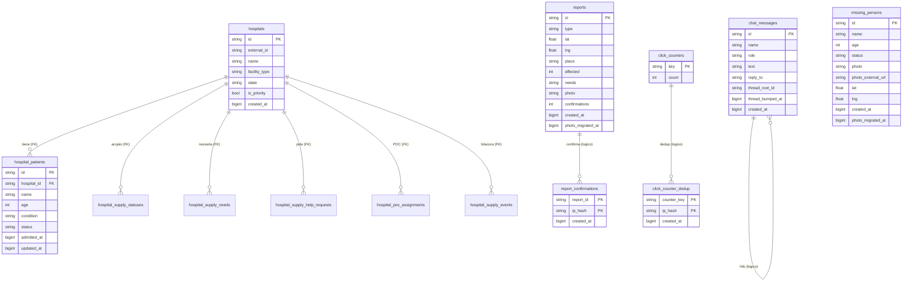

# Modelo de datos

Esquema de la base de datos (Neon Postgres / Hetzner `app`) del proyecto
**Mapa de Emergencia y Rescate**.

> **Fuente de verdad:** [`infra/db/schema.ts`](../../infra/db/schema.ts) (Drizzle)
> define las **35 tablas** que existen en prod: canónicas activas (reportes,
> personas, hospitales y su acopio `hospital_supply_*` / `hospital_poc_*`,
> donaciones, contadores, sync) + `contact_messages` (ya en Drizzle) +
> `analytics_events`, `damage_candidates`, `unidentified_persons` (legado/externas
> sin código de app, pero presentes en la base) + la federación `hub_*` con el
> hub central (espejo read-only, ver RFC 0002) + el tier **RBAC/auth** del panel
> admin (`capabilities`, `roles`, `role_capabilities`, `users`,
> `permission_grants`, `invitations`, `password_resets`, `audit_log`; ver RFC
> 0005). Si cambias el esquema, edita `schema.ts`, corre `npm run db:generate` y
> luego actualiza este doc.

## Convenciones

Tomadas del código (ver cabecera de `schema.ts`):

- **IDs de texto:** `id TEXT PRIMARY KEY`, generados por la app con
  `crypto.randomUUID()`. Excepción: `sync_runs.id` es `BIGSERIAL`.
- **Marcas de tiempo:** epoch en **milisegundos** guardado como `BIGINT`
  (modo `number`; valores dentro de `Number.MAX_SAFE_INTEGER`).
- **Coordenadas:** `DOUBLE PRECISION` (`lat` / `lng`).
- **`photo_migrated_at`:** marca cuándo la foto se movió a R2. `NULL` = pendiente
  (lo usa el worker de re-hospedaje para reclamar solo filas sin migrar).

## Resumen de tablas

| Tabla | Grupo | PK | Propósito |
| --- | --- | --- | --- |
| `reports` | canónica | `id` | Reportes de emergencia en el mapa |
| `report_confirmations` | canónica | `(report_id, ip_hash)` | Dedup de confirmaciones por IP |
| `missing_persons` | canónica | `id` | Personas desaparecidas / localizadas |
| `chat_messages` | canónica | `id` | Chat ciudadano (con hilos) |
| `hospitals` | canónica | `id` | Hospitales y centros de atención |
| `hospital_patients` | canónica | `id` | Pacientes por hospital (**FK** → hospitals) |
| `hospital_supply_statuses` | canónica | `id` | Estado de insumos por hospital (**FK** → hospitals) |
| `hospital_supply_needs` | canónica | `id` | Necesidades de insumos por hospital (**FK** → hospitals) |
| `hospital_supply_help_requests` | canónica | `id` | Pedidos de ayuda del hospital (**FK** → hospitals) |
| `hospital_poc_assignments` | canónica | `id` | POC asignado al hospital (**FK** → hospitals) |
| `hospital_supply_events` | canónica | `id` | Bitácora de eventos de acopio (**FK** → hospitals) |
| `donations` | canónica | `id` | Donaciones registradas |
| `click_counters` | canónica | `key` | Contadores de clics agregados |
| `click_counter_dedup` | canónica | `(counter_key, ip_hash)` | Dedup de clics por IP |
| `geocode_cache` | canónica | `normalized_key` | Caché de geocodificación |
| `sync_state` | canónica | `source` | Estado de paginación de cada sync |
| `sync_runs` | canónica | `id` | Bitácora de ejecuciones de sync |
| `contact_messages` | canónica | `id` | Bandeja de contacto (admin) |
| `analytics_events` | legado/externa | `id` | Eventos de analítica (sin código de app) |
| `damage_candidates` | legado/externa | `id` | Candidatos de daño estructural (sin código) |
| `unidentified_persons` | legado/externa | `id` | Personas no identificadas (sin código) |
| `hub_missing_persons` | federación | `id` | Espejo read-only de desaparecidos del hub |
| `hub_checkins` | federación | `id` | Espejo read-only de check-ins del hub |
| `hub_help_requests` | federación | `id` | Espejo read-only de pedidos de ayuda del hub |
| `hub_help_offers` | federación | `id` | Espejo read-only de ofertas de ayuda del hub |
| `hub_damaged_buildings` | federación | `id` | Espejo read-only de edificios dañados del hub |
| `hub_sync_state` | federación | `type` | Cursor de paginación por tipo del hub |
| `capabilities` | RBAC/auth | `key` | Catálogo fijo de capacidades (`recurso:verbo`) |
| `roles` | RBAC/auth | `id` | Roles creados por admins (filas, no enum) |
| `role_capabilities` | RBAC/auth | `(role_id, capability_key)` | M:N rol↔capacidad |
| `users` | RBAC/auth | `id` | Usuarios autenticados del panel admin |
| `permission_grants` | RBAC/auth | `id` | Capacidad individual encima del rol |
| `invitations` | RBAC/auth | `id` | Alta por invitación (token de un solo uso) |
| `password_resets` | RBAC/auth | `id` | Recuperación de contraseña por OTP |
| `audit_log` | RBAC/auth | `id` | Bitácora de mutaciones sensibles |

---

## Tablas canónicas (`infra/db/schema.ts`)

### `reports`

Reportes de emergencia que se muestran en el mapa.

| Columna | Tipo | Nulo | Default | Notas |
| --- | --- | --- | --- | --- |
| `id` | TEXT | no | — | PK |
| `type` | TEXT | no | — | Tipo de marcador |
| `lat` | DOUBLE PRECISION | no | — | |
| `lng` | DOUBLE PRECISION | no | — | |
| `place` | TEXT | no | — | Nombre/dirección |
| `affected` | INTEGER | no | `0` | Personas afectadas |
| `needs` | TEXT | no | `''` | |
| `photo` | TEXT | sí | — | base64 o URL del CDN tras migrar |
| `confirmations` | INTEGER | no | `0` | |
| `created_at` | BIGINT | no | — | epoch-ms |
| `photo_migrated_at` | BIGINT | sí | — | `NULL` = foto sin migrar a R2 |

Índices: `idx_reports_created_at (created_at DESC)`;
`idx_reports_photo_pending (id) WHERE photo_migrated_at IS NULL AND photo IS NOT NULL`.

### `report_confirmations`

Dedup de confirmaciones de un reporte por IP (append-only).

| Columna | Tipo | Nulo | Default | Notas |
| --- | --- | --- | --- | --- |
| `report_id` | TEXT | no | — | PK compuesta · *lógico* → `reports.id` |
| `ip_hash` | TEXT | no | — | PK compuesta |
| `created_at` | BIGINT | no | — | epoch-ms |

PK: `(report_id, ip_hash)`.

### `missing_persons`

Personas desaparecidas y localizadas (incluye registros importados por sync).

| Columna | Tipo | Nulo | Default | Notas |
| --- | --- | --- | --- | --- |
| `id` | TEXT | no | — | PK |
| `name` | TEXT | no | — | |
| `age` | INTEGER | sí | — | |
| `nationality` | TEXT | no | `''` | |
| `description` | TEXT | no | `''` | |
| `last_seen` | TEXT | no | `''` | |
| `contact` | TEXT | no | `''` | |
| `photo` | TEXT | sí | — | base64 o URL del CDN tras migrar |
| `status` | TEXT | no | `'active'` | `active` / `found` |
| `resolution_note` | TEXT | sí | — | |
| `resolution_photo` | TEXT | sí | — | Foto-prueba al localizar |
| `resolved_at` | BIGINT | sí | — | epoch-ms |
| `external_id` | TEXT | sí | — | ID en la fuente externa |
| `source` | TEXT | sí | — | Fuente del registro |
| `source_url` | TEXT | sí | — | |
| `photo_external_url` | TEXT | sí | — | Foto alojada externamente |
| `lat` | DOUBLE PRECISION | sí | — | |
| `lng` | DOUBLE PRECISION | sí | — | |
| `created_at` | BIGINT | no | — | epoch-ms |
| `photo_migrated_at` | BIGINT | sí | — | cubre `photo` y `photo_external_url` |

Índices: `idx_missing_status_created (status, created_at DESC)`;
`idx_missing_map_coords (lat, lng)`;
`idx_missing_photo_pending (id) WHERE photo_migrated_at IS NULL AND (photo IS NOT NULL OR photo_external_url IS NOT NULL)`;
`missing_persons_source_external_id_idx (source, external_id) UNIQUE WHERE external_id IS NOT NULL`
(árbitro del `ON CONFLICT` del upsert de registros externos).

### `chat_messages`

Chat ciudadano con soporte de respuestas e hilos (auto-referencia lógica).

| Columna | Tipo | Nulo | Default | Notas |
| --- | --- | --- | --- | --- |
| `id` | TEXT | no | — | PK |
| `name` | TEXT | no | `'Anónimo'` | |
| `role` | TEXT | no | `'ciudadano'` | |
| `text` | TEXT | no | — | |
| `reply_to` | TEXT | sí | — | *lógico* → `chat_messages.id` |
| `reply_preview` | TEXT | sí | — | |
| `thread_root_id` | TEXT | sí | — | *lógico* → `chat_messages.id` |
| `thread_bumped_at` | BIGINT | sí | — | epoch-ms |
| `created_at` | BIGINT | no | — | epoch-ms |

Índices: `idx_chat_thread_bumped (thread_bumped_at DESC)`;
`idx_chat_reply (reply_to)`.

> Prod conserva 3 columnas legado en desuso (`reply_to_id`, `reply_to_name`,
> `reply_to_text`), sustituidas por `reply_to` / `reply_preview`. Se omiten del
> esquema Drizzle a propósito.

### `hospitals`

Hospitales y centros de atención.

| Columna | Tipo | Nulo | Default | Notas |
| --- | --- | --- | --- | --- |
| `id` | TEXT | no | — | PK |
| `external_id` | TEXT | sí | — | único WHERE NOT NULL |
| `name` | TEXT | no | — | |
| `facility_type` | TEXT | no | `'hospital'` | |
| `state` | TEXT | no | `''` | |
| `municipality` | TEXT | no | `''` | |
| `address` | TEXT | no | `''` | |
| `level` | TEXT | sí | — | |
| `priority_zone` | TEXT | no | `'P3'` | |
| `is_priority` | BOOLEAN | no | `false` | |
| `created_at` | BIGINT | no | — | epoch-ms |

Índices: `idx_hospitals_external (external_id) UNIQUE WHERE external_id IS NOT NULL`;
`idx_hospitals_state (state, priority_zone, name)`.

### `hospital_patients`

Pacientes asociados a un hospital. Una de las **6 FK reales** del esquema, todas
hacia `hospitals.id` con `ON DELETE CASCADE`.

| Columna | Tipo | Nulo | Default | Notas |
| --- | --- | --- | --- | --- |
| `id` | TEXT | no | — | PK |
| `hospital_id` | TEXT | no | — | **FK** → `hospitals.id` `ON DELETE CASCADE` |
| `name` | TEXT | no | — | |
| `age` | INTEGER | sí | — | |
| `condition` | TEXT | no | `'unknown'` | |
| `status` | TEXT | no | `'hospitalized'` | |
| `notes` | TEXT | no | `''` | |
| `contact` | TEXT | no | `''` | |
| `admitted_at` | BIGINT | no | — | epoch-ms |
| `updated_at` | BIGINT | no | — | epoch-ms |

Índices: `idx_hospital_patients_hospital (hospital_id, status, admitted_at DESC)`.

### `hospital_supply_statuses`

Estado de cada categoría de insumos de un hospital (semáforo de acopio).
**FK** `hospital_id` → `hospitals.id` `ON DELETE CASCADE`.

| Columna | Tipo | Nulo | Default | Notas |
| --- | --- | --- | --- | --- |
| `id` | TEXT | no | — | PK |
| `hospital_id` | TEXT | no | — | **FK** → `hospitals.id` `ON DELETE CASCADE` |
| `category` | TEXT | no | — | |
| `status` | TEXT | no | `'unknown'` | |
| `public_note` | TEXT | no | `''` | Nota visible al público |
| `restricted_note` | TEXT | no | `''` | Nota interna/restringida |
| `stale_after_hours` | INTEGER | no | `12` | Umbral de "dato viejo" |
| `last_updated_at` | BIGINT | no | — | epoch-ms |
| `last_confirmed_at` | BIGINT | no | — | epoch-ms |
| `updated_by` | TEXT | no | `'equipo_operativo'` | |
| `source` | TEXT | no | `'admin_panel'` | |
| `created_at` | BIGINT | no | — | epoch-ms |

Índices: `idx_hospital_supply_status_unique (hospital_id, category) UNIQUE`;
`idx_hospital_supply_status_stale (category, status, last_confirmed_at)`;
`idx_hospital_supply_status_hospital (hospital_id)`.

### `hospital_supply_needs`

Necesidades puntuales de insumos por hospital. **FK** `hospital_id` →
`hospitals.id` `ON DELETE CASCADE`.

| Columna | Tipo | Nulo | Default | Notas |
| --- | --- | --- | --- | --- |
| `id` | TEXT | no | — | PK |
| `hospital_id` | TEXT | no | — | **FK** → `hospitals.id` `ON DELETE CASCADE` |
| `category` | TEXT | no | — | |
| `item_type` | TEXT | no | — | |
| `quantity` | INTEGER | sí | — | |
| `unit` | TEXT | no | `''` | |
| `urgency` | TEXT | no | `'yellow'` | |
| `status` | TEXT | no | `'active'` | |
| `public_note` | TEXT | no | `''` | |
| `restricted_note` | TEXT | no | `''` | |
| `last_confirmed_at` | BIGINT | no | — | epoch-ms |
| `updated_by` | TEXT | no | `'equipo_operativo'` | |
| `source` | TEXT | no | `'admin_panel'` | |
| `created_at` | BIGINT | no | — | epoch-ms |
| `updated_at` | BIGINT | no | — | epoch-ms |

Índices: `idx_hospital_supply_needs_active (hospital_id, status, urgency, updated_at DESC)`;
`idx_hospital_supply_needs_category (category, status)`.

### `hospital_supply_help_requests`

Pedidos de ayuda emitidos por el hospital. **FK** `hospital_id` →
`hospitals.id` `ON DELETE CASCADE`.

| Columna | Tipo | Nulo | Default | Notas |
| --- | --- | --- | --- | --- |
| `id` | TEXT | no | — | PK |
| `hospital_id` | TEXT | no | — | **FK** → `hospitals.id` `ON DELETE CASCADE` |
| `category` | TEXT | no | — | |
| `message` | TEXT | no | `''` | |
| `urgency` | TEXT | no | `'yellow'` | |
| `status` | TEXT | no | `'open'` | |
| `requested_by` | TEXT | no | `'poc_hospitalario'` | |
| `source` | TEXT | no | `'admin_panel'` | |
| `restricted_note` | TEXT | no | `''` | |
| `created_at` | BIGINT | no | — | epoch-ms |
| `updated_at` | BIGINT | no | — | epoch-ms |

Índices: `idx_hospital_supply_help_open (status, urgency, created_at DESC)`;
`idx_hospital_supply_help_hospital (hospital_id)`.

### `hospital_poc_assignments`

Punto de contacto (POC) asignado a un hospital. **FK** `hospital_id` →
`hospitals.id` `ON DELETE CASCADE`.

| Columna | Tipo | Nulo | Default | Notas |
| --- | --- | --- | --- | --- |
| `id` | TEXT | no | — | PK |
| `hospital_id` | TEXT | no | — | **FK** → `hospitals.id` `ON DELETE CASCADE` |
| `display_name` | TEXT | no | `'POC hospitalario'` | |
| `role` | TEXT | no | `'hospital_poc'` | |
| `restricted_contact` | TEXT | no | `''` | Contacto interno/restringido |
| `access_token_hash` | TEXT | no | `''` | Hash del token de acceso del POC |
| `active` | BOOLEAN | no | `true` | |
| `created_at` | BIGINT | no | — | epoch-ms |
| `updated_at` | BIGINT | no | — | epoch-ms |

Índices: `idx_hospital_poc_assignments_hospital (hospital_id, active)`;
`idx_hospital_poc_assignments_token (hospital_id, access_token_hash, active)`.

### `hospital_supply_events`

Bitácora de acciones sobre el acopio de un hospital. **FK** `hospital_id` →
`hospitals.id` `ON DELETE CASCADE`.

| Columna | Tipo | Nulo | Default | Notas |
| --- | --- | --- | --- | --- |
| `id` | TEXT | no | — | PK |
| `hospital_id` | TEXT | no | — | **FK** → `hospitals.id` `ON DELETE CASCADE` |
| `category` | TEXT | sí | — | |
| `entity_type` | TEXT | no | — | |
| `entity_id` | TEXT | sí | — | |
| `action` | TEXT | no | — | |
| `actor` | TEXT | no | `'equipo_operativo'` | |
| `source` | TEXT | no | `'admin_panel'` | |
| `payload` | JSONB | no | `{}` | |
| `created_at` | BIGINT | no | — | epoch-ms |

Índices: `idx_hospital_supply_events_hospital (hospital_id, created_at DESC)`;
`idx_hospital_supply_events_entity (entity_type, entity_id)`.

### `donations`

Donaciones registradas (append-only en la práctica; ver `worker/tables.ts`).

| Columna | Tipo | Nulo | Default | Notas |
| --- | --- | --- | --- | --- |
| `id` | TEXT | no | — | PK |
| `name` | TEXT | no | — | |
| `amount_usd` | INTEGER | no | — | en centavos |
| `ip_hash` | TEXT | sí | — | |
| `user_agent` | TEXT | sí | — | |
| `created_at` | BIGINT | no | — | epoch-ms |
| `status` | TEXT | no | `'intent'` | ciclo de vida; el código no lo muta hoy |

Índices: `donations_created_at_idx (created_at DESC)`.

> Nota: `status` existe en prod y ya está en el esquema Drizzle. Hoy el código
> nunca lo actualiza (insert-only), por eso `worker/tables.ts` la migra como
> append-only (`ignore`). Si se agrega un flujo que mute `status`, cambia su
> política de migración a `update`.

### `click_counters`

Contadores de clics agregados.

| Columna | Tipo | Nulo | Default | Notas |
| --- | --- | --- | --- | --- |
| `key` | TEXT | no | — | PK |
| `count` | INTEGER | no | `0` | |

### `click_counter_dedup`

Dedup de clics por IP (append-only).

| Columna | Tipo | Nulo | Default | Notas |
| --- | --- | --- | --- | --- |
| `counter_key` | TEXT | no | — | PK compuesta · *lógico* → `click_counters.key` |
| `ip_hash` | TEXT | no | — | PK compuesta |
| `created_at` | BIGINT | no | — | epoch-ms |

PK: `(counter_key, ip_hash)`.

### `geocode_cache`

Caché de geocodificación de lugares.

| Columna | Tipo | Nulo | Default | Notas |
| --- | --- | --- | --- | --- |
| `normalized_key` | TEXT | no | — | PK |
| `lat` | DOUBLE PRECISION | no | — | |
| `lng` | DOUBLE PRECISION | no | — | |
| `label` | TEXT | no | `''` | |
| `updated_at` | BIGINT | no | — | epoch-ms |

### `sync_state`

Estado de paginación por fuente de sincronización.

| Columna | Tipo | Nulo | Default | Notas |
| --- | --- | --- | --- | --- |
| `source` | TEXT | no | — | PK |
| `next_page` | INTEGER | no | `1` | |
| `total_pages` | INTEGER | sí | — | |
| `last_run_at` | BIGINT | sí | — | epoch-ms |
| `last_cycle_completed_at` | BIGINT | sí | — | epoch-ms |
| `updated_at` | BIGINT | no | — | epoch-ms |

### `sync_runs`

Bitácora de ejecuciones de sync (append-only).

| Columna | Tipo | Nulo | Default | Notas |
| --- | --- | --- | --- | --- |
| `id` | BIGSERIAL | no | seq | PK |
| `source` | TEXT | no | — | |
| `trigger` | TEXT | sí | — | |
| `ok` | BOOLEAN | no | — | |
| `fetched` | INTEGER | no | `0` | |
| `inserted` | INTEGER | no | `0` | |
| `updated` | INTEGER | no | `0` | |
| `skipped` | INTEGER | no | `0` | |
| `errors` | INTEGER | no | `0` | |
| `from_page` | INTEGER | sí | — | |
| `to_page` | INTEGER | sí | — | |
| `next_page` | INTEGER | sí | — | |
| `cycle_completed` | BOOLEAN | sí | — | |
| `error` | TEXT | sí | — | |
| `duration_ms` | INTEGER | no | `0` | |
| `started_at` | BIGINT | no | — | epoch-ms |
| `finished_at` | BIGINT | no | — | epoch-ms |

Índices: `idx_sync_runs_started (started_at DESC)`.

---

## Tablas adicionales (admin / legado)

> Estas tablas ya están en `infra/db/schema.ts`. `contact_messages` es la
> bandeja de contacto del panel admin; las otras 3 son legado/externas sin
> código de app (presentes solo porque existen en prod y la migración las copia).

### `contact_messages`

Bandeja de contacto del panel admin. Definida en `infra/db/schema.ts` y
consumida por [`backend/src/services/contact.ts`](../../backend/src/services/contact.ts)
vía Drizzle (ya no usa `CREATE TABLE IF NOT EXISTS` en runtime).

| Columna | Tipo | Nulo | Default | Notas |
| --- | --- | --- | --- | --- |
| `id` | TEXT | no | — | PK |
| `name` | TEXT | no | — | |
| `email` | TEXT | no | — | |
| `subject` | TEXT | no | — | |
| `message` | TEXT | no | — | |
| `read` | BOOLEAN | no | `false` | |
| `ip_hash` | TEXT | sí | — | |
| `created_at` | BIGINT | no | — | epoch-ms |

Índices: `contact_messages_created_at_idx (created_at DESC)`;
`contact_messages_unread_idx (read, created_at DESC)`.

### `analytics_events` — legado/externa (sin código de app)

Presente en la fuente Neon y copiada por la migración; sin referencias en el
código de la app. Definición tomada de la base.

| Columna | Tipo | Nulo | Notas |
| --- | --- | --- | --- |
| `id` | TEXT | no | PK |
| `session_id` | TEXT | no | |
| `type` | TEXT | no | |
| `path` | TEXT | no | |
| `label` | TEXT | no | |
| `referrer` | TEXT | no | |
| `user_agent` | TEXT | no | |
| `screen` | TEXT | no | |
| `language` | TEXT | no | |
| `metadata` | JSONB | no | |
| `created_at` | BIGINT | no | epoch-ms |

### `damage_candidates` — legado/externa (sin código de app)

| Columna | Tipo | Nulo | Notas |
| --- | --- | --- | --- |
| `id` | TEXT | no | PK |
| `building_id` | TEXT | no | |
| `name` | TEXT | no | |
| `lat` | DOUBLE PRECISION | no | |
| `lng` | DOUBLE PRECISION | no | |
| `damage_level` | TEXT | no | |
| `confidence` | DOUBLE PRECISION | no | |
| `review_status` | TEXT | no | |
| `source_before` | TEXT | no | |
| `source_after` | TEXT | no | |
| `source_url` | TEXT | no | |
| `notes` | TEXT | no | |
| `created_at` | BIGINT | no | epoch-ms |
| `updated_at` | BIGINT | no | epoch-ms |

### `unidentified_persons` — legado/externa (sin código de app)

| Columna | Tipo | Nulo | Notas |
| --- | --- | --- | --- |
| `id` | TEXT | no | PK |
| `status` | TEXT | no | |
| `name` | TEXT | no | |
| `surname` | TEXT | no | |
| `location_found` | TEXT | no | |
| `description` | TEXT | no | |
| `contact_name` | TEXT | no | |
| `contact_phone` | TEXT | no | |
| `photo` | TEXT | sí | |
| `created_at` | BIGINT | no | epoch-ms |

---

## Federación con el hub central (`hub_*`)

Espejo **read-only** de los datos de otros sitios socios traídos del hub central
"Venezuela Ayuda" (ver [`docs/rfcs/0002-federacion-hub-venezuela-ayuda.md`](../rfcs/0002-federacion-hub-venezuela-ayuda.md)).
Una tabla por tipo del hub; nunca se mezclan con las tablas nativas.

Columnas comunes (`hubCommon`) en todas las `hub_*` salvo `hub_sync_state`:
`id` (PK), `hub_id` (uuid del hub, **UNIQUE** → idempotencia del upsert),
`source`, `external_id`, `city`, `lat`, `lng`, `hub_created_at` (ISO del hub),
`ingested_at`, `updated_at`. Los tipos con foto agregan `photo_external_url`,
`photo_url`, `photo_migrated_at` (NULL = pendiente) y `photo_broken`.

| Tabla | Foto | Campos propios |
| --- | --- | --- |
| `hub_missing_persons` | sí | `name`, `status`, `message`, `place_name` |
| `hub_checkins` | sí | `name`, `status`, `message`, `place_name` |
| `hub_help_requests` | no | `category`, `description`, `urgency`, `status`, `place_name` |
| `hub_help_offers` | no | `category`, `description`, `availability`, `available` |
| `hub_damaged_buildings` | sí | `place_name`, `name`, `description`, `severity` |

Índices: cada tabla tiene `idx_hub_<tipo>_hubid (hub_id) UNIQUE` y
`idx_hub_<tipo>_source (source)`; `hub_missing_persons` añade
`idx_hub_missing_photo_pending (id) WHERE photo_migrated_at IS NULL AND photo_external_url IS NOT NULL`.

### `hub_sync_state`

Cursor de paginación por tipo del hub (equivalente a `sync_state` para la
federación).

| Columna | Tipo | Nulo | Default | Notas |
| --- | --- | --- | --- | --- |
| `type` | TEXT | no | — | PK (`missing_person`, `checkin`, …) |
| `cursor` | TEXT | sí | — | último `next_cursor` visto (NULL = desde el inicio) |
| `last_run_at` | BIGINT | sí | — | epoch-ms |
| `cycle_completed_at` | BIGINT | sí | — | epoch-ms |

---

## RBAC / auth (panel admin)

Tier de control de acceso del panel admin standalone (ver
[`docs/rfcs/0005-panel-admin-standalone.md`](../rfcs/0005-panel-admin-standalone.md)).
Motor RBAC: un usuario tiene un **rol base** (bundle de capacidades) más posibles
**grants individuales** con expiración/revocación. El catálogo de capacidades es
fijo y se siembra por migración (`backend/src/auth/capabilities.ts`). Las
columnas `org_id` viajan en `roles`/`users`/`grants`/`invitations` pero hoy
quedan `NULL` (global); son el gancho para multi-tenancy en fase 2. Las
relaciones entre estas tablas son **lógicas** (FK app-side, sin DDL de FK).

### `capabilities`

Catálogo fijo de capacidades (`recurso:verbo`). No lo crean usuarios.

| Columna | Tipo | Nulo | Default | Notas |
| --- | --- | --- | --- | --- |
| `key` | TEXT | no | — | PK (`"report:create"`, `"user:invite"`, …) |
| `description` | TEXT | no | `''` | |
| `category` | TEXT | no | `''` | Agrupa para la UI de admin |

### `roles`

Roles creados por admins (filas, no enum).

| Columna | Tipo | Nulo | Default | Notas |
| --- | --- | --- | --- | --- |
| `id` | TEXT | no | — | PK |
| `name` | TEXT | no | — | |
| `description` | TEXT | no | `''` | |
| `is_system` | BOOLEAN | no | `false` | Rol semilla `admin` inmutable |
| `org_id` | TEXT | sí | — | `NULL` = global (fase 2) |
| `created_by` | TEXT | sí | — | *lógico* → `users.id` (NULL para el semilla) |
| `created_at` | BIGINT | no | — | epoch-ms |
| `updated_at` | BIGINT | sí | — | epoch-ms |

Índices: `idx_roles_name_global (name) UNIQUE WHERE org_id IS NULL`;
`idx_roles_name_org (org_id, name) UNIQUE WHERE org_id IS NOT NULL`.

### `role_capabilities`

M:N rol↔capacidades.

| Columna | Tipo | Nulo | Default | Notas |
| --- | --- | --- | --- | --- |
| `role_id` | TEXT | no | — | PK compuesta · *lógico* → `roles.id` |
| `capability_key` | TEXT | no | — | PK compuesta · *lógico* → `capabilities.key` |

PK: `(role_id, capability_key)`. Índice: `idx_role_caps_role (role_id)`.

### `users`

Usuarios autenticados (≠ ciudadanos anónimos del sitio público).

| Columna | Tipo | Nulo | Default | Notas |
| --- | --- | --- | --- | --- |
| `id` | TEXT | no | — | PK |
| `email` | TEXT | no | — | único (case-insensitive) |
| `name` | TEXT | no | `''` | |
| `password_hash` | TEXT | sí | — | bcrypt; `NULL` hasta aceptar invitación |
| `role_id` | TEXT | sí | — | rol base · *lógico* → `roles.id` |
| `org_id` | TEXT | sí | — | fase 2 |
| `status` | TEXT | no | `'invited'` | `invited` / `active` / `disabled` |
| `created_at` | BIGINT | no | — | epoch-ms |
| `last_login_at` | BIGINT | sí | — | epoch-ms |

Índices: `idx_users_email (lower(email)) UNIQUE`; `idx_users_role (role_id)`.

### `permission_grants`

Capacidad individual encima del rol. Sujeto = user **o** role (XOR app-side).
Activo = `revoked_at` NULL y (`expires_at` NULL o futura).

| Columna | Tipo | Nulo | Default | Notas |
| --- | --- | --- | --- | --- |
| `id` | TEXT | no | — | PK |
| `capability_key` | TEXT | no | — | *lógico* → `capabilities.key` |
| `subject_type` | TEXT | no | — | `"user"` / `"role"` |
| `subject_user_id` | TEXT | sí | — | set si `subject_type=user` |
| `subject_role_id` | TEXT | sí | — | set si `subject_type=role` |
| `org_id` | TEXT | sí | — | fase 2 |
| `granted_by` | TEXT | no | — | *lógico* → `users.id` |
| `granted_at` | BIGINT | no | — | epoch-ms |
| `expires_at` | BIGINT | sí | — | `NULL` = sin expiración |
| `revoked_at` | BIGINT | sí | — | `NULL` = activo |
| `revoked_by` | TEXT | sí | — | |
| `reason` | TEXT | no | `''` | |

Índices: `idx_grants_cap_subject (capability_key, subject_type, revoked_at)`;
`idx_grants_user (subject_user_id)`; `idx_grants_role (subject_role_id)`.

### `invitations`

Alta por invitación. `token_hash` = sha256 del token enviado por email (nunca se
guarda en claro). Un solo uso; caduca.

| Columna | Tipo | Nulo | Default | Notas |
| --- | --- | --- | --- | --- |
| `id` | TEXT | no | — | PK |
| `email` | TEXT | no | — | |
| `role_id` | TEXT | sí | — | rol al aceptar · *lógico* → `roles.id` |
| `org_id` | TEXT | sí | — | fase 2 |
| `token_hash` | TEXT | no | — | sha256 |
| `invited_by` | TEXT | no | — | *lógico* → `users.id` |
| `created_at` | BIGINT | no | — | epoch-ms |
| `expires_at` | BIGINT | no | — | epoch-ms |
| `accepted_at` | BIGINT | sí | — | `NULL` = pendiente |

Índices: `idx_invitations_token (token_hash) UNIQUE`;
`idx_invitations_email (lower(email))`.

### `password_resets`

Recuperación de contraseña por OTP (código de 6 dígitos al email). Solo se guarda
el **hash** del código (sha256). Un solo uso, caduca en minutos; `attempts`
limita el fuerza-bruta.

| Columna | Tipo | Nulo | Default | Notas |
| --- | --- | --- | --- | --- |
| `id` | TEXT | no | — | PK |
| `user_id` | TEXT | no | — | *lógico* → `users.id` |
| `code_hash` | TEXT | no | — | sha256 del OTP |
| `created_at` | BIGINT | no | — | epoch-ms |
| `expires_at` | BIGINT | no | — | epoch-ms |
| `consumed_at` | BIGINT | sí | — | `NULL` = sin usar |
| `attempts` | INTEGER | no | `0` | |

Índices: `idx_pwreset_user (user_id)`; `idx_pwreset_expires (expires_at)`.

### `audit_log`

Bitácora de TODA mutación sensible (auth + escrituras de `api/public/*`).

| Columna | Tipo | Nulo | Default | Notas |
| --- | --- | --- | --- | --- |
| `id` | BIGSERIAL | no | seq | PK |
| `actor_user_id` | TEXT | sí | — | `NULL` = sistema/anónimo |
| `action` | TEXT | no | — | `"role.create"`, `"report.delete"`, … |
| `target_type` | TEXT | sí | — | `"report"`, `"user"`, `"role"`, … |
| `target_id` | TEXT | sí | — | |
| `metadata` | JSONB | sí | — | contexto (antes/después, ids afectados) |
| `ip_hash` | TEXT | sí | — | IP hasheada, nunca cruda |
| `created_at` | BIGINT | no | — | epoch-ms |

Índices: `idx_audit_created (created_at DESC)`; `idx_audit_actor (actor_user_id)`;
`idx_audit_target (target_type, target_id)`.

---

## Relaciones

- **FK reales (6, todas → `hospitals.id` con `ON DELETE CASCADE`):**
  `hospital_patients`, `hospital_supply_statuses`, `hospital_supply_needs`,
  `hospital_supply_help_requests`, `hospital_poc_assignments` y
  `hospital_supply_events`, cada una por su columna `hospital_id`.
- **Relaciones lógicas (no forzadas por FK):**
  - `report_confirmations.report_id` → `reports.id`
  - `click_counter_dedup.counter_key` → `click_counters.key`
  - `chat_messages.reply_to` / `thread_root_id` → `chat_messages.id` (auto-ref)
  - `sync_state.source` / `sync_runs.source` comparten el espacio de "fuentes",
    sin clave foránea entre sí.
  - **RBAC/auth** (todas app-side, sin DDL de FK): `role_capabilities` →
    `roles` / `capabilities`; `users.role_id` → `roles`; `permission_grants` →
    `capabilities` + (`users` o `roles`); `invitations.role_id` → `roles`;
    `password_resets.user_id` → `users`; `audit_log.actor_user_id` → `users`.

El resto de las tablas son independientes (sin relaciones).

### Diagrama (Mermaid)

> `(FK)` = clave foránea real; `(logico)` = relación lógica no forzada por la
> base de datos. Mermaid `erDiagram` solo dibuja líneas sólidas; la distinción
> va en la etiqueta.

> El diagrama muestra solo las tablas **con relaciones de FK real**. Las demás
> (`donations`, `geocode_cache`, `sync_state`, `sync_runs`, `contact_messages`,
> `analytics_events`, `damage_candidates`, `unidentified_persons`, la familia
> `hub_*` de federación y el tier RBAC/auth) son independientes a nivel de FK; el
> tier RBAC tiene relaciones **lógicas** (ver arriba) y sus columnas están en las
> secciones de arriba.
